# CLAUDE.md

> 变更记录 (Changelog)
> - 2026-03-15: 初始化架构师自动扫描，全量重写，新增 Mermaid 结构图、模块索引、详细 API 清单、SSE/MCP 说明。

This file provides guidance to Claude Code (claude.ai/code) when working with code in this repository.

---

## 项目愿景与定位

AI 写标书助手（yibiao-simple）是一款面向招投标场景的智能写作工具。用户上传招标文件（PDF/Word），AI 自动提取项目概述与技术评分要求，随后一键生成专业三级目录和各章节正文，最终可导出 Word 文档。核心价值：**大幅降低标书撰写门槛，提高投标效率**。

---

## 架构总览

项目采用前后端分离架构，开发时前后端独立运行，生产/打包时前端静态文件内嵌到 FastAPI 服务中。

```
用户浏览器
    |
    | HTTP / SSE
    v
React SPA (localhost:3000 开发 / 同源 生产)
    |
    | REST API / SSE
    v
FastAPI 后端 (localhost:8000)
    |
    |-- OpenAI API（兼容协议，支持自定义 base_url）
    |-- DuckDuckGo 搜索（duckduckgo-search 库）
    |-- 文件系统（uploads/ 临时文件，~/.ai_write_helper/ 配置）
    |-- MCP Server（backend/mcp/server/duckduckgo/ 独立进程）
```

---

## 模块结构图

```mermaid
graph TD
    ROOT["(根) yibiao-simple"] --> BACKEND["backend"]
    ROOT --> FRONTEND["frontend"]
    ROOT --> MCP["backend/mcp"]

    BACKEND --> APP["backend/app"]
    APP --> ROUTERS["routers (6个路由模块)"]
    APP --> SERVICES["services (3个服务)"]
    APP --> UTILS["utils (5个工具)"]
    APP --> MODELS["models/schemas.py"]

    ROUTERS --> R_CONFIG["config.py"]
    ROUTERS --> R_DOC["document.py"]
    ROUTERS --> R_OUTLINE["outline.py"]
    ROUTERS --> R_CONTENT["content.py"]
    ROUTERS --> R_SEARCH["search.py"]
    ROUTERS --> R_EXPAND["expand.py"]

    SERVICES --> S_OPENAI["openai_service.py"]
    SERVICES --> S_FILE["file_service.py"]
    SERVICES --> S_SEARCH["search_service.py"]

    UTILS --> U_CONFIG["config_manager.py"]
    UTILS --> U_PROMPT["prompt_manager.py"]
    UTILS --> U_OUTLINE["outline_util.py"]
    UTILS --> U_JSON["json_util.py"]
    UTILS --> U_SSE["sse.py"]

    FRONTEND --> SRC["frontend/src"]
    SRC --> PAGES["pages (3个页面)"]
    SRC --> COMPONENTS["components (2个组件)"]
    SRC --> HOOKS["hooks/useAppState.ts"]
    SRC --> FSERVICES["services/api.ts"]
    SRC --> FTYPES["types/index.ts"]
    SRC --> FUTILS["utils/draftStorage.ts"]

    MCP --> DDGSRV["mcp/server/duckduckgo/main.py"]

    click APP "./backend/CLAUDE.md" "查看 backend 模块文档"
    click FRONTEND "./frontend/CLAUDE.md" "查看 frontend 模块文档"
    click MCP "./backend/mcp/CLAUDE.md" "查看 MCP 模块文档"
```



---

## 模块索引

| 模块路径 | 语言 | 职责简述 | 文档链接 |
|---|---|---|---|
| `backend/` | Python | FastAPI 后端，AI 调用、文件处理、API 服务 | [backend/CLAUDE.md](./backend/CLAUDE.md) |
| `frontend/` | TypeScript/React | SPA 前端，三步流程 UI、状态管理、草稿缓存 | [frontend/CLAUDE.md](./frontend/CLAUDE.md) |
| `backend/mcp/` | Python | 独立 MCP Server，对外暴露 DuckDuckGo 搜索工具 | [backend/mcp/CLAUDE.md](./backend/mcp/CLAUDE.md) |

---

## 运行与开发

### 一键启动（推荐）
```bash
# 同时启动前后端（app_launcher.py 协调）
python app_launcher.py
```

### 分别启动
```bash
# 后端
cd backend
pip install -r requirements.txt
python run.py
# 默认监听 http://localhost:8000

# 前端
cd frontend
npm install
npm start
# 默认监听 http://localhost:3000
```

### 构建打包（Windows exe）
```bash
python build.py
# 或
build.bat
```

### 关键端口
| 服务 | 地址 |
|---|---|
| 后端 API | http://localhost:8000 |
| 后端 API 文档 | http://localhost:8000/docs |
| 健康检查 | http://localhost:8000/health |
| 前端开发服务器 | http://localhost:3000 |

### 环境变量
- `backend/.env.example` — 后端环境变量示例（API Key、base_url 等）
- `frontend/.env.example` — 前端环境变量示例（`REACT_APP_API_URL`）
- 用户运行时配置持久化到 `~/.ai_write_helper/user_config.json`（不在 Git 中）

---

## 核心业务流程

```
步骤 0（标书解析）：
  上传 PDF/Word -> /api/document/upload
  -> 提取文本（pdfplumber / docx2python 多策略）
  -> /api/document/analyze-stream（SSE）
  -> 分别提取 projectOverview 和 techRequirements

步骤 1（目录编辑）：
  projectOverview + techRequirements
  -> /api/outline/generate（SSE心跳 + 并发批处理）
     内部：generate_outline_v2 先生成一级提纲 -> 并发补全二三级
  -> 可选上传旧方案文件 /api/expand/upload（提取已有目录）
  -> /api/outline/generate-stream（使用旧目录辅助生成）

步骤 2（正文编辑）：
  单章节 -> /api/content/generate-chapter-stream（SSE）
  全量导出 -> /api/document/export-word（Word 二进制流）
```

---

## API 接口总览

| 前缀 | 方法 | 路径 | 说明 |
|---|---|---|---|
| config | POST | /api/config/save | 保存 OpenAI 配置 |
| config | GET | /api/config/load | 加载配置 |
| config | POST | /api/config/models | 获取可用模型列表 |
| document | POST | /api/document/upload | 上传文档（PDF/Word） |
| document | POST | /api/document/analyze-stream | 流式分析文档（SSE） |
| document | POST | /api/document/export-word | 导出 Word 文档（二进制流） |
| outline | POST | /api/outline/generate | 生成目录（SSE心跳+批量） |
| outline | POST | /api/outline/generate-stream | 流式生成目录（旧方案模式）|
| content | POST | /api/content/generate-chapter | 生成单章节（同步） |
| content | POST | /api/content/generate-chapter-stream | 流式生成单章节（SSE） |
| search | POST/GET | /api/search/ | DuckDuckGo 搜索 |
| search | POST | /api/search/formatted | 获取格式化搜索结果 |
| search | POST | /api/search/load-url | 读取网页内容 |
| expand | POST | /api/expand/upload | 上传旧方案文件，提取已有目录 |

---

## 测试策略

- 前端：`frontend/src/App.test.tsx`（基础 render 测试，使用 @testing-library/react）
- 后端：`backend/mcp/client/test.py`（MCP 客户端连通性测试）
- 当前测试覆盖率较低，业务逻辑主要靠手动测试验证
- 执行前端测试：`cd frontend && npm test`

---

## 编码规范

- 所有 UI 文本使用简体中文
- API 接口提供中文错误信息
- TypeScript 接口与 Pydantic 模型保持字段名一致性
- 异步操作需要有错误处理和用户反馈
- 文件上传大小上限：10MB（`backend/app/config.py` 中配置）
- SSE 响应统一使用 `backend/app/utils/sse.py` 中的 `sse_response()` 工具函数
- JSON 结构校验使用 `backend/app/utils/json_util.py` 中的 `check_json()`，支持自动重试
- 每次新增 Python 依赖必须同步更新 `backend/requirements.txt` 和 `build.py`

---

## AI 使用指引

- 修改 AI 提示词请编辑 `backend/app/utils/prompt_manager.py`
- 新增 AI 生成能力请在 `backend/app/services/openai_service.py` 中扩展
- `generate_outline_v2()` 采用两阶段并发生成：先串行生成一级提纲，再并发补全二三级目录
- `_generate_with_json_check()` 是带 JSON 校验和自动重试（最多3次）的通用生成函数
- 温度参数：分析类任务用 `temperature=0.3`，生成类任务用 `temperature=0.7`
- 目录生成目标字数：10万字（约 67 个叶子节点，每节点约 1500 字）
- 支持兼容 OpenAI 协议的第三方模型（通过 `base_url` 配置）

---

## 变更记录 (Changelog)

| 日期 | 内容 |
|---|---|
| 2026-03-15 | 初始化架构师扫描，全量生成根级与模块级 CLAUDE.md，补充 Mermaid 图、完整 API 清单、SSE/MCP/提示词等关键信息 |
